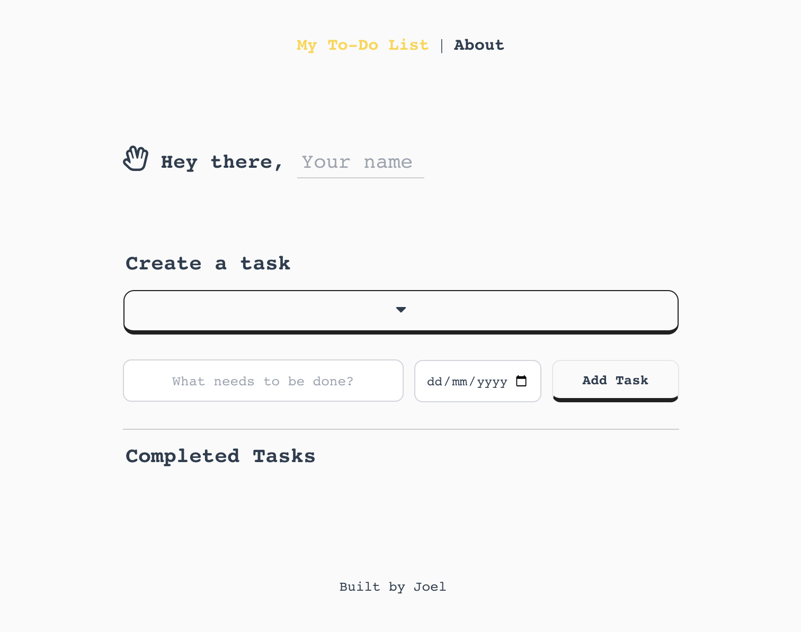
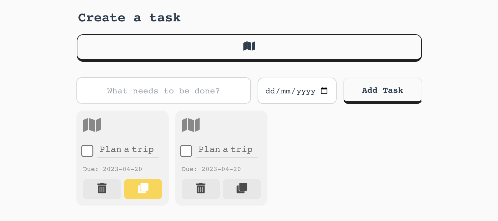
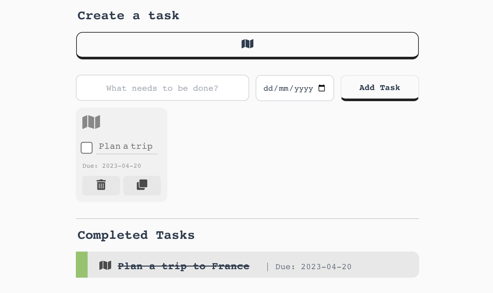
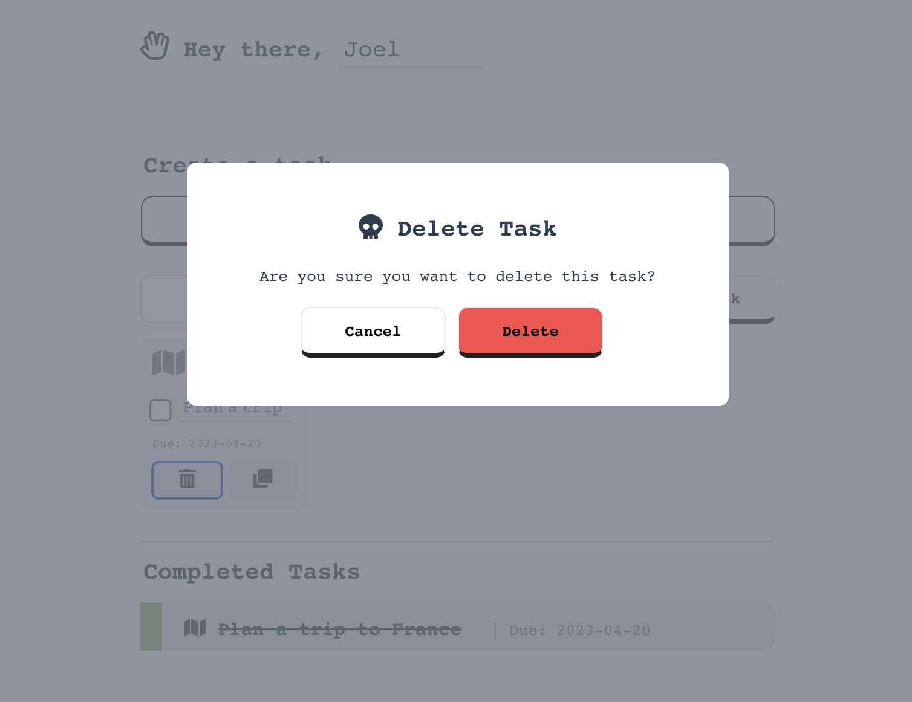
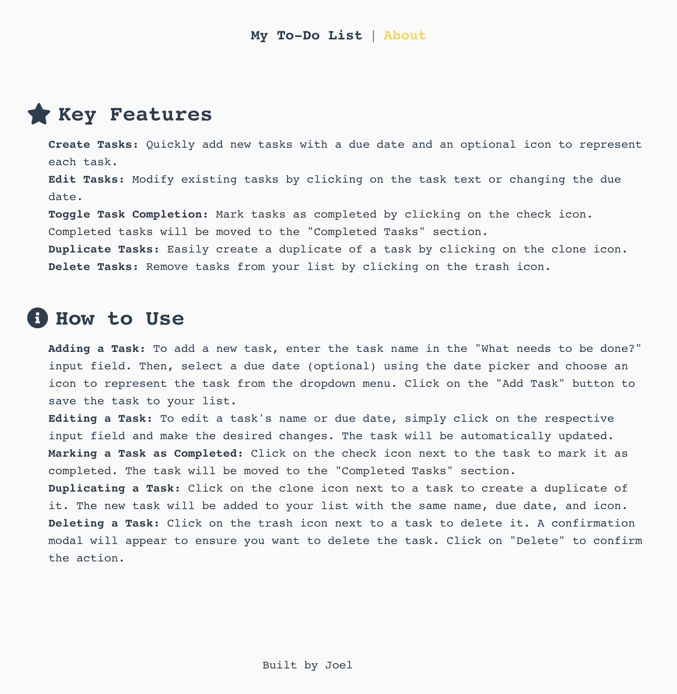

# ToDo List Application | A Vue 2 & Tailwind CSS Project

This project is a Vue.js 2.7.14 application integrated with VueX & Tailwind CSS. 
It demonstrates how to create a create a list of tasks, with a set due date that can be edited, deleted or cloned further.
It's a responsive web application using Vue.js as the frontend framework, VueX for state management and Tailwind CSS for styling, along with custom CSS for an enhanced UI/UX.

## Screenshots

### Home Page of the To-Do List Application:

### Creating a Task:

### Task Creation Complete:

### Task Complete:

### Deleting a Task:

### The About Page:

## Features

- Vue.js 2.7.14: A progressive JavaScript framework for building user interfaces.
- Tailwind CSS: A utility-first CSS framework for rapidly building custom user interfaces.
- Responsive design: Adapts seamlessly to various screen sizes and devices.
- Customizable components: Easily modify and extend the components according to your needs.

## Prerequisites

- Node.js (v12.x or higher recommended)
- npm
- Vue.js 2.x
- Vue CLI
- VueX
- FontAwesomeJS

## Installation

1. Clone the repository: `git clone https://github.com/joelpaulk/todolist-vuejs-app.git`
2. Navigate to the project folder: `todolist-vuejs-app`
3. Install the dependencies.

## Development

To start the development server, run: `npm run serve`.
The application will be available at `http://localhost:8080`.

## Building for Production

To create a production build, run: `npm run build`,
The compiled files will be available in the `dist` folder.
