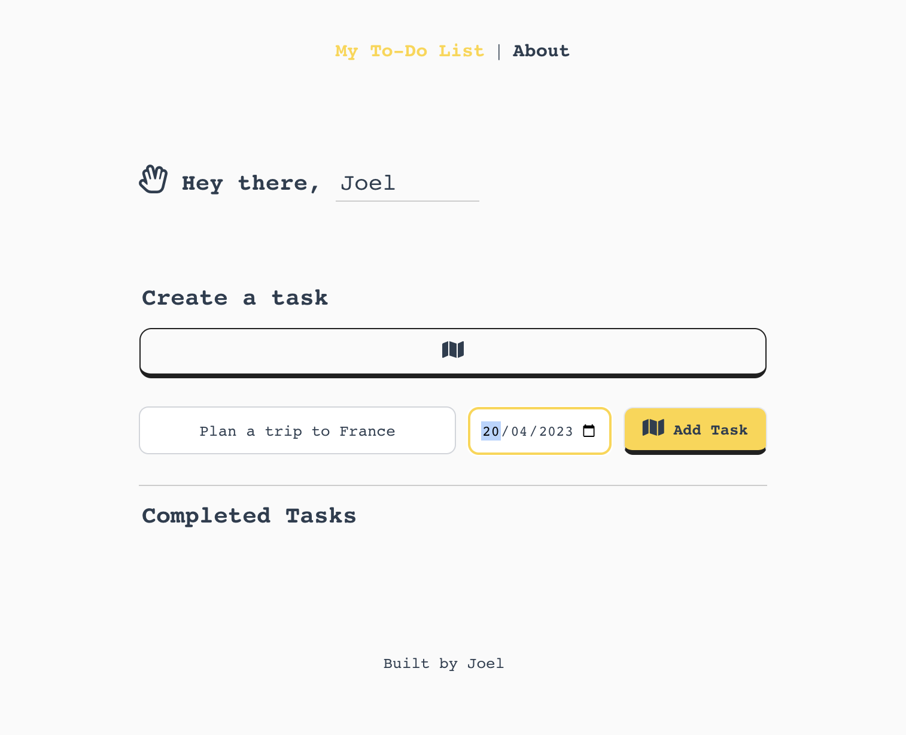

# ToDo List Application | A Vue 2 & Tailwind CSS Project

This project is a Vue.js 2.7.14 application integrated with VueX & Tailwind CSS. 
It demonstrates how to create a create a list of tasks, with a set due date that can be edited, deleted or cloned further.
It's a responsive web application using Vue.js as the frontend framework, VueX for state management and Tailwind CSS for styling, along with custom CSS for an enhanced UI/UX.

## Screenshots

### Home Page of the To-Do List Application:

### Creating a Task:

### Task Creation Complete:

### Task Complete:

### Deleting a Task:

### The About Page:

## Features

- Vue.js 2.7.14: A progressive JavaScript framework for building user interfaces.
- Tailwind CSS: A utility-first CSS framework for rapidly building custom user interfaces.
- Responsive design: Adapts seamlessly to various screen sizes and devices.
- Customizable components: Easily modify and extend the components according to your needs.

## Prerequisites

- Node.js (v12.x or higher recommended)
- npm
- vue: ^2.6.11
- vuex: ^3.4.0
- Vue CLI
- FontAwesomeJS
- vue-router: ^3.2.0
- tailwindcss: ^2.0.3
- axios: ^0.21.1
- @vue/test-utils: ^1.1.3
- jest: ^26.6.3
- babel-jest: ^26.6.3

## Installation

1. Clone the repository: `git clone https://github.com/joelpaulk/todolist-vuejs-app.git`
2. Navigate to the project folder: `todolist-vuejs-app`
3. Install the dependencies.

## Development

To start the development server, run: `npm run serve`.
The application will be available at `http://localhost:8080`.

## Building for Production

To create a production build, run: `npm run build`,
The compiled files will be available in the `dist` folder.

## Unit Tests

We have the below basic unit tests in this project:

1. A test case for TodoList.vue component that checks if the component renders the correct number of todo items.
Here's a step-by-step breakdown of the test:

 -  An array of todos is created with two sample todo items.
 - The shallowMount function is used to create a wrapper around the TodoList component. The $store object is mocked, and the pendingTodos getter is set to return the sample todos array while the completedTodos getter is set to return an empty array.
 - The test checks if the number of elements with the class .todo-item in the component's rendered output matches the length of the todos array (in this case, 2).

The purpose of this test is to ensure that the TodoList.vue component renders the pending todo items correctly based on the data provided by the Vuex store's pendingTodos getter.

2. A test case to test our documentative AboutApp.vue component. It tests:

 - It checks if the component renders the 'Key Features' heading.
 - It checks if the component renders the 'How to Use' heading.
A step-by-step breakdown of the test:

For the first test, the expected heading text 'Key Features' is defined.
The shallowMount function is used to create a wrapper around the AboutApp component.
The test checks if the component's rendered output contains the 'Key Features' heading.

For the second test, the expected heading text 'How to Use' is defined.
The shallowMount function is used to create a wrapper around the AboutApp component.
The test checks if the component's rendered output contains the 'How to Use' heading.

The primary purpose of these tests is to ensure that the AboutApp.vue component correctly renders the 'Key Features' and 'How to Use' headings.

3. A ytest case for the IconSelector.vue component:

 - It checks if the component renders the correct number of icons.

Step-by-step explanation of the test:

 - An array of icons is created with a list of seven sample icon names.
 - The shallowMount function is used to create a wrapper around the IconSelector component, and the icons array is passed as a prop to the component.
 - The test checks if the number of elements with the class .todo-task-icon in the component's rendered output matches the length of the icons array (in this case, 7).

Primary purpose of this test is to ensure that the IconSelector.vue component correctly renders the icons based on the data provided by the icons prop.

You can run these tests using: `npm run test:unit`